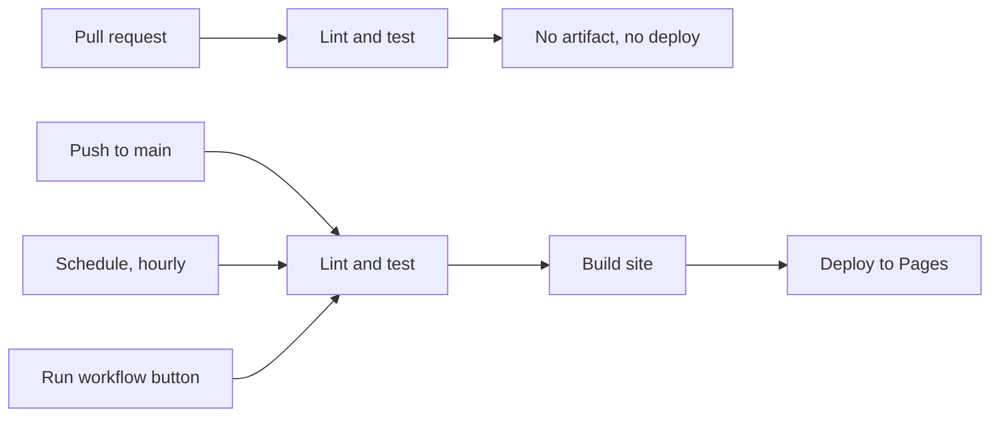

# status-page

A public status page for a handful of services. A scheduled pipeline probes them
every hour, regenerates the page and publishes it — nobody touches it in between.

**Live:** https://YOUR-USERNAME.github.io/status-page/


This repository exists to demonstrate a **CI/CD pipeline**, not clever application
code. The application is small on purpose: the interesting part is
[`.github/workflows/ci.yml`](.github/workflows/ci.yml) and the reasoning below.

---

## What happens, and when



| Trigger | Lint and test | Build | Deploy |
|---|:---:|:---:|:---:|
| Pull request | ✅ | — | — |
| Push to `main` | ✅ | ✅ | ✅ |
| Hourly schedule | ✅ | ✅ | ✅ |
| Manual button | ✅ | ✅ | ✅ |

`main` is protected: no direct pushes, and **`Lint and test` must pass before a
pull request can be merged**.

---

## Design decisions

Most of these are choices that could reasonably have gone the other way. The
reasoning matters more than the choice.

### The probe is split in two

`probe()` makes the HTTP request. `classify()` turns an observation into a
verdict and is a **pure function** — no network, no clock, no files.

Every rule lives in `classify()`, so the whole rule set is covered by a table of
eight cases that runs in milliseconds and never touches the internet. Testing
"a redirect is not an outage" is one line, not a fixture server.

### CI does not run `main.py`

`main.py` makes real requests to third-party services. If the pull request check
ran it, a PR would go red because somebody else's website had a bad minute.

The check job runs **tests**. The build job runs the probe, because probing is
the product.

### The build job only runs if the checks passed

`needs: check` — the site is never built from code that failed. A pull request
never publishes anything, which is what `if: github.event_name != 'pull_request'`
is for.

### Two dependency files

`requirements.txt` is what the **application** needs to run. `requirements-dev.txt`
adds what the **pipeline** needs to verify it. `ruff` and `pytest` never have to
exist where the application runs, so the build job installs only the first one.

### There are no secrets in this repository

Deploying uses `id-token: write` to obtain a short-lived identity token at the
start of the job. There is nothing to create, store or rotate, and nothing to
leak. Write permissions are granted **per job**: the file opens with
`contents: read`, and only the deploy job gets more.

### There is no manual approval gate — on purpose

An obvious thing to add here would be a required reviewer on the `github-pages`
environment. It would be wrong.

The hourly run republishes **the same code with new data**. Nobody decided
anything, so there is nothing to approve — and with an hourly schedule it would
produce a queue of deployments waiting for someone to click a button twenty-four
times a day.

What deserves a gate is a change to the code, and that already has one: the pull
request, with a required status check. **The pull request is the approval.**

### No container image — yet

The artifact is the generated `public/` directory, uploaded by the workflow. A
container image would demonstrate the same idea (build once, deploy the same
thing everywhere) and can be added later: the build job changes what it
produces, and nothing else moves.

---

## Known limitations

These are real and unfixed. They are here because a status page that hides its
own blind spots is worse than one that admits them.

- **The probe cannot tell "the service is down" from "I can't reach it."**
  A network failure is recorded as `code=None` and reported as `down`. A broken
  runner network would paint every service red.
- **A single probe from a single place.** No retry, no second opinion, no check
  from another region. One slow response is enough to report `degraded`.
- **The schedule switches itself off.** GitHub disables scheduled workflows in a
  public repository after 60 days without activity. The page would then freeze on
  its last run while still looking current.
- **No history.** Each run overwrites the page; there is no uptime percentage and
  no record of past incidents.

---

## Running it locally

```bash
python3 -m venv .venv && source .venv/bin/activate
pip install -r requirements-dev.txt

python -m pytest -q          # the tests, no network needed
ruff check . && ruff format --check .

python main.py               # probes for real, writes public/index.html
```

The pipeline runs exactly these commands. If they pass here, they pass there —
that is the point of pinning the versions in `requirements-dev.txt`.

---

## Layout

```
.github/workflows/ci.yml   the pipeline: check -> build -> deploy
targets.yml                the services being watched
src/probe.py               the request, and the pure classify() function
src/render.py              checks -> HTML, also pure
main.py                    reads targets, probes, writes public/index.html
tests/                     the rules and the rendered page
pyproject.toml             ruff and pytest settings
requirements.txt           what the application needs
requirements-dev.txt       what the pipeline needs on top
```

## Adding a service

Add two lines to `targets.yml`, open a pull request, and let the checks run.